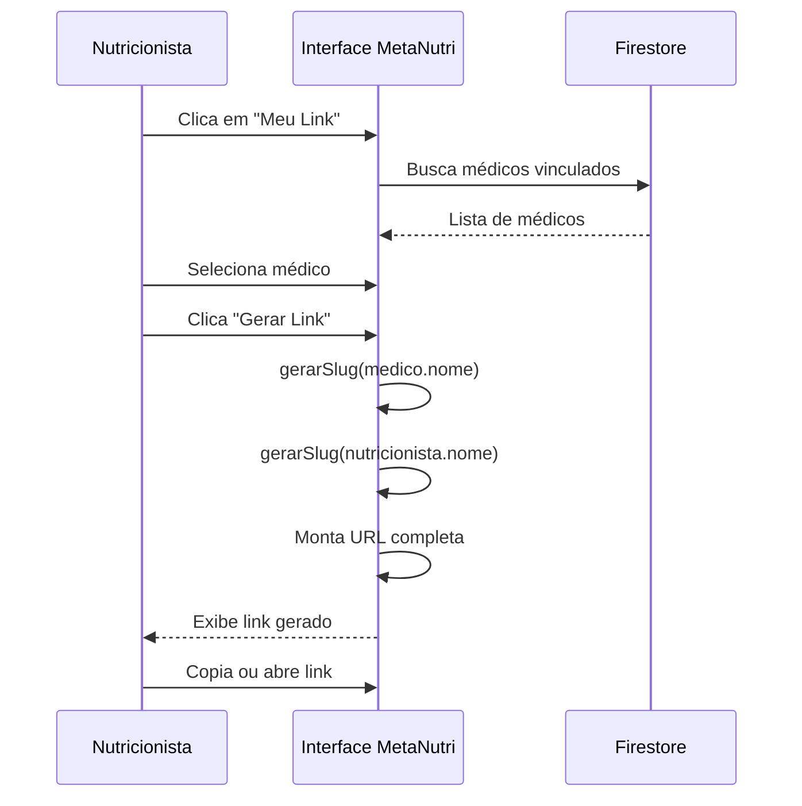
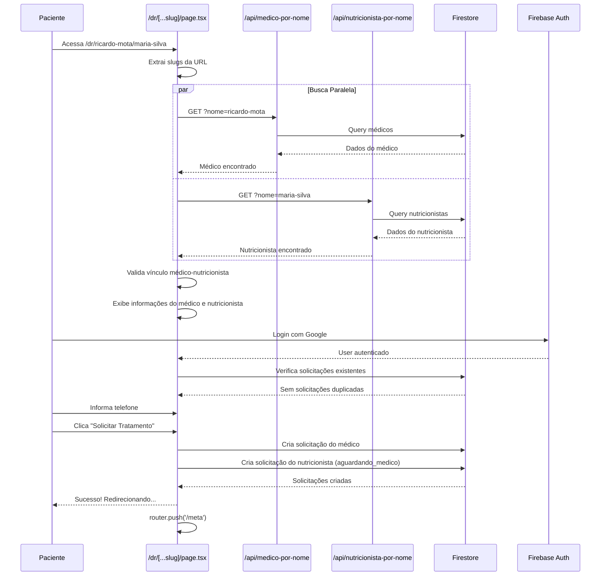
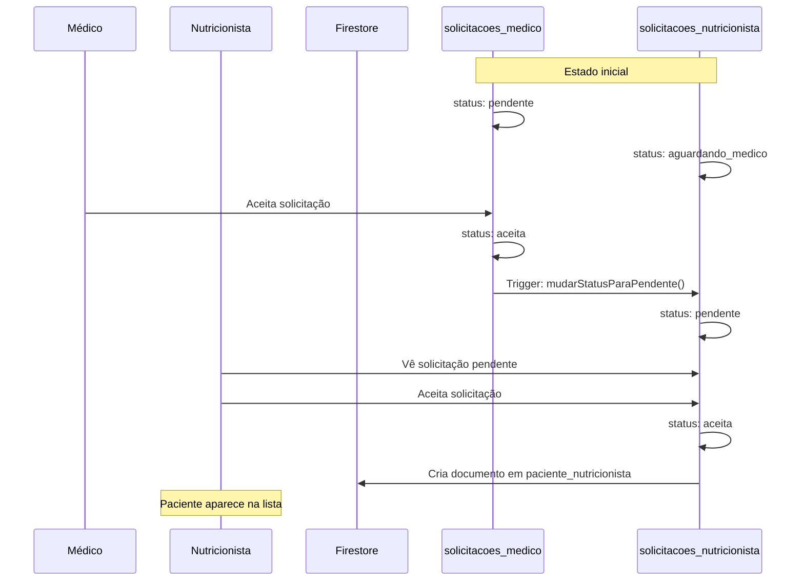

# Feature "Meu Link" - MetaNutri para MetaPersonal

## 📋 Índice

1. [Visão Geral](#visão-geral)
2. [Como Funciona no MetaNutri](#como-funciona-no-metanutri)
3. [Arquitetura Técnica](#arquitetura-técnica)
4. [Fluxo de Dados Completo](#fluxo-de-dados-completo)
5. [Implementação Atual no MetaNutri](#implementação-atual-no-metanutri)
6. [Adaptação para MetaPersonal](#adaptação-para-metapersonal)
7. [Guia de Implementação](#guia-de-implementação)
8. [Validações e Segurança](#validações-e-segurança)
9. [Referências de Arquivos](#referências-de-arquivos)

---

## Visão Geral

### O que é o "Meu Link"?

O **Meu Link** é uma funcionalidade que permite que **nutricionistas** (e futuramente **personal trainers**) gerem links de referral personalizados que criam automaticamente **solicitações simultâneas** para dois profissionais quando um paciente acessa o link.

### Fluxo Resumido

```
Nutricionista → Seleciona Médico → Gera Link → Paciente Acessa Link → Cria Solicitações (Médico + Nutricionista)
```

### Formato do Link

```
https://www.oftware.com.br/dr/{nome-sobrenome-medico}/{nome-sobrenome-nutricionista}
```

**Exemplo:**
```
https://www.oftware.com.br/dr/ricardo-mota/maria-silva
```

---

## Como Funciona no MetaNutri

### 1. Menu Superior - Botão "Meu Link"

**Localização:** Barra superior → Dropdown do perfil do nutricionista

O botão "Meu Link" aparece no menu dropdown do perfil, junto com outras opções como "Meu Perfil" e "Sair".

**Arquivo:** `app/metanutri/page.v2.tsx`

**Desktop (linhas 6430-6439):**
```tsx
<button
  onClick={() => {
    setShowLinkModal(true);
    setShowProfileDropdown(false);
  }}
  className="w-full text-left px-4 py-2.5 text-sm text-gray-700 dark:text-gray-300 hover:bg-gray-50 dark:hover:bg-gray-700 flex items-center gap-2"
>
  <LinkIcon size={16} className="text-gray-600 dark:text-gray-400" />
  Meu Link
</button>
```

**Mobile (linhas 6550-6559):**
Implementação idêntica, adaptada para telas menores.

---

### 2. Modal de Geração de Link

**Localização:** `app/metanutri/page.v2.tsx` (linhas 6711-6856)

#### Elementos do Modal:

1. **Header**
   - Título: "Meu Link" com ícone de link
   - Botão de fechar (X)

2. **Caixa Informativa**
   - Cor: Azul (bg-blue-50)
   - Texto: Explicação sobre a funcionalidade
   ```tsx
   <div className="bg-blue-50 border border-blue-200 rounded-lg p-4 mb-4">
     <p className="text-sm text-blue-700">
       Gere um link para indicar pacientes a um médico. O paciente será redirecionado 
       para solicitar acompanhamento com o médico escolhido.
     </p>
   </div>
   ```

3. **Dropdown de Seleção de Médico**
   - Lista apenas médicos **vinculados** ao nutricionista
   - Filtro: `medicoVinculadoIds.includes(m.id)`
   - Mostra: Nome, gênero (Dr./Dra.) e CRM
   ```tsx
   {medicosVerificados
     .filter(m => nutricionista.medicoVinculadoIds.includes(m.id))
     .map((medico) => (
       <option key={medico.id} value={medico.id}>
         {medico.genero === 'F' ? 'Dra.' : 'Dr.'} {medico.nome} - CRM {medico.crm.estado} {medico.crm.numero}
       </option>
     ))}
   ```

4. **Botão "Gerar Link"**
   - Só aparece quando um médico é selecionado
   - Ao clicar, gera o link formatado

5. **Campo de Link Gerado**
   - Input read-only com o link completo
   - Dois botões de ação:
     - **Copiar:** Copia para área de transferência
     - **Abrir:** Abre o link em nova aba

---

### 3. Lógica de Geração do Slug

**Função:** `gerarSlug()` (linhas 6778-6792)

```tsx
const gerarSlug = (nome: string): string => {
  const normalizar = (str: string) => {
    return str
      .normalize('NFD')
      .replace(/[\u0300-\u036f]/g, '') // Remove acentos
      .toLowerCase()
      .trim();
  };
  
  const partesNome = nome.trim().split(/\s+/).filter(p => p.length > 0);
  // Pegar primeiro nome e último sobrenome
  return partesNome.length > 1
    ? `${normalizar(partesNome[0])}-${normalizar(partesNome[partesNome.length - 1])}`
    : normalizar(partesNome[0]);
};
```

**Exemplos de conversão:**
- `"Ricardo Mota"` → `"ricardo-mota"`
- `"Maria José Silva Santos"` → `"maria-santos"`
- `"João"` → `"joao"`

**Geração do link completo (linhas 6794-6799):**
```tsx
const slugMedico = gerarSlug(medicoSelecionado.nome);
const slugNutricionista = gerarSlug(nutricionista.nome);

const baseUrl = typeof window !== 'undefined' ? window.location.origin : '';
const link = `${baseUrl}/dr/${slugMedico}/${slugNutricionista}`;
setLinkReferralGerado(link);
```

---

## Arquitetura Técnica

### Estrutura de Rotas

```
/dr/[...slug]/page.tsx → Página de landing do paciente
```

A rota usa **catch-all dynamic route** `[...slug]` para capturar:
- `slug[0]` → Nome-sobrenome do médico
- `slug[1]` → Nome-sobrenome do nutricionista (opcional)

---

### APIs de Lookup

#### 1. API Médico por Nome

**Arquivo:** `app/api/medico-por-nome/route.ts`

**Endpoint:** `GET /api/medico-por-nome?nome={slug}`

**Lógica:**
1. Recebe slug (ex: `"ricardo-mota"`)
2. Converte para formato de busca: `"Ricardo Mota"`
3. Busca médicos cujo nome começa com essa string
4. Retorna primeiro médico encontrado

**Código de conversão:**
```typescript
const partesNome = nomeSobrenome
  .split('-')
  .map(parte => parte.charAt(0).toUpperCase() + parte.slice(1).toLowerCase());

const nomeBusca = partesNome.join(' ');
```

#### 2. API Nutricionista por Nome

**Arquivo:** `app/api/nutricionista-por-nome/route.ts`

**Endpoint:** `GET /api/nutricionista-por-nome?nome={slug}`

**Lógica idêntica à API do médico:**
```typescript
export async function GET(request: NextRequest) {
  const searchParams = request.nextUrl.searchParams;
  const nomeSobrenome = searchParams.get('nome');
  
  if (!nomeSobrenome) {
    return NextResponse.json(
      { error: 'Parâmetro "nome" é obrigatório' },
      { status: 400 }
    );
  }

  const db = getFirebaseAdmin();
  const nutricionistasSnapshot = await db.collection('nutricionistas').get();
  
  // Converter nomeSobrenome de "maria-silva" para "Maria Silva"
  const partesNome = nomeSobrenome
    .split('-')
    .map(parte => parte.charAt(0).toUpperCase() + parte.slice(1).toLowerCase());
  
  const nomeBusca = partesNome.join(' ');
  
  // Buscar nutricionista que tenha o nome começando com o nome buscado
  const nutricionistas = nutricionistasSnapshot.docs
    .map(doc => ({
      id: doc.id,
      ...doc.data(),
      dataCadastro: data.dataCadastro?.toDate?.() || data.dataCadastro,
    }))
    .filter((nutri: any) => {
      const nomeNutri = (nutri.nome || '').trim().toLowerCase();
      return nomeNutri.startsWith(nomeBusca.toLowerCase());
    });
  
  if (nutricionistas.length === 0) {
    return NextResponse.json(
      { error: 'Nutricionista não encontrado' },
      { status: 404 }
    );
  }
  
  return NextResponse.json(nutricionistas[0]);
}
```

---

## Fluxo de Dados Completo

### Fase 1: Nutricionista Gera o Link



### Fase 2: Paciente Acessa o Link



### Fase 3: Processamento das Solicitações



---

## Implementação Atual no MetaNutri

### Página de Landing (`app/dr/[...slug]/page.tsx`)

#### Estados Principais

```typescript
const [medico, setMedico] = useState<Medico | null>(null);
const [nutricionista, setNutricionista] = useState<NutricionistaDoc | null>(null);
const [loading, setLoading] = useState(true);
const [user, setUser] = useState<User | null>(null);
const [paciente, setPaciente] = useState<PacienteCompleto | null>(null);
const [showTelefoneModal, setShowTelefoneModal] = useState(false);
const [telefone, setTelefone] = useState('');
const [criandoSolicitacao, setCriandoSolicitacao] = useState(false);
const [solicitacaoCriada, setSolicitacaoCriada] = useState(false);
const [error, setError] = useState<string | null>(null);
```

#### Extração dos Slugs

```typescript
// Extrair nome e sobrenome da URL
// dr/ricardo-mota -> apenas médico
// dr/ricardo-mota/maria-silva -> médico + nutricionista
const slug = params?.slug as string[] || [];
const nomeSobrenomeMedico = slug[0] || '';
const nomeSobrenomeNutricionista = slug[1] || null;
```

#### Validações Implementadas

**No useEffect de busca de dados (linhas 36-110):**

1. ✅ Médico existe e está ativo
2. ✅ Nutricionista existe e está ativo (se presente na URL)
3. ✅ Nutricionista está vinculado ao médico
4. ✅ Ambos estão verificados (`isVerificado === true`)

**Código de validação do vínculo (linhas 85-90):**
```typescript
// Validar que o nutricionista está vinculado ao médico
if (!nutriData.medicoVinculadoIds || !nutriData.medicoVinculadoIds.includes(medicoData.id)) {
  setError('Nutricionista não está vinculado a este médico');
  setLoading(false);
  return;
}
```

#### Verificação de Solicitações Duplicadas

**useEffect dedicado (linhas 143-162):**
```typescript
useEffect(() => {
  const verificarSolicitacaoExistente = async () => {
    if (user && medico && user.email) {
      try {
        const solicitacoes = await SolicitacaoMedicoService.getSolicitacoesPorPaciente(user.email);
        const solicitacaoExistente = solicitacoes.find(s => s.medicoId === medico.id);
        
        if (solicitacaoExistente) {
          // Se já existe uma solicitação, redirecionar para /meta
          console.log('Paciente já possui solicitação para este médico. Redirecionando...');
          router.push('/meta');
        }
      } catch (err) {
        console.error('Erro ao verificar solicitação existente:', err);
      }
    }
  };

  verificarSolicitacaoExistente();
}, [user, medico, router]);
```

---

### Serviço de Criação de Solicitações

**Arquivo:** `services/solicitacaoMedicoService.ts`

#### Método: `criarSolicitacao()`

**Assinatura:**
```typescript
static async criarSolicitacao(
  solicitacao: Omit<SolicitacaoMedicoDoc, 'id' | 'criadoEm'>,
  emailIndicador?: string,
  nutricionistaInfo?: {
    nutricionistaId: string;
    nutricionistaNome: string;
  }
): Promise<string>
```

**Fluxo interno (linhas 12-152):**

1. **Verifica duplicidade** (solicitação pendente)
2. **Cria solicitação do médico:**
   - Adiciona `nutricionistaId` e `nutricionistaNome` (se fornecidos)
   - Status: `pendente`
   - Salva em `solicitacoes_medico`
3. **Se houver nutricionista, cria solicitação do nutricionista:**
   - Chama `SolicitacaoNutricionistaService.createPacienteShareRequest()`
   - Status: `aguardando_medico`
   - Salva referência: `solicitacaoNutricionistaId`
4. **Atualiza solicitação do médico** com o ID da solicitação do nutricionista

**Código relevante (linhas 60-150):**
```typescript
// Criar solicitação médico
const novaSolicitacao: any = {
  pacienteEmail: solicitacao.pacienteEmail,
  pacienteNome: solicitacao.pacienteNome,
  pacienteTelefone: solicitacao.pacienteTelefone,
  medicoId: solicitacao.medicoId,
  medicoNome: solicitacao.medicoNome,
  status: 'pendente',
  criadoEm: Timestamp.now(),
  emailIndicador: emailIndicador || null,
};

// Se houver nutricionista, adicionar ao documento
if (nutricionistaInfo) {
  novaSolicitacao.nutricionistaId = nutricionistaInfo.nutricionistaId;
  novaSolicitacao.nutricionistaNome = nutricionistaInfo.nutricionistaNome;
}

if (solicitacao.pacienteId) {
  novaSolicitacao.pacienteId = solicitacao.pacienteId;
}

const docRef = await addDoc(collection(db, COL_SOLICITACOES_MEDICO), novaSolicitacao);

// Se houver nutricionista, criar solicitação para ele também
if (nutricionistaInfo && solicitacao.pacienteId) {
  try {
    const solicitacaoNutriId = await SolicitacaoNutricionistaService.createPacienteShareRequest(
      solicitacao.medicoId,
      nutricionistaInfo.nutricionistaId,
      solicitacao.pacienteId,
      {
        pacienteNome: solicitacao.pacienteNome,
        medicoNome: solicitacao.medicoNome,
        nutricionistaNome: nutricionistaInfo.nutricionistaNome,
        nutricionistaEmail: '', // Será buscado pelo service
      },
      'aguardando_medico'
    );
    
    // Atualizar solicitação do médico com ID da solicitação do nutricionista
    await updateDoc(docRef, {
      solicitacaoNutricionistaId: solicitacaoNutriId,
    });
  } catch (err) {
    console.error('Erro ao criar solicitação do nutricionista:', err);
  }
}

return docRef.id;
```

---

### Serviço de Solicitação do Nutricionista

**Arquivo:** `services/solicitacaoNutricionistaService.ts`

#### Método: `createPacienteShareRequest()`

**Parâmetros especiais:**
- `statusEspecial?: 'aguardando_medico'` - Define status inicial especial

**Lógica (linhas 33-129):**
```typescript
static async createPacienteShareRequest(
  medicoId: string,
  nutricionistaId: string,
  pacienteId: string,
  extraData?: {
    pacienteNome?: string;
    medicoNome?: string;
    nutricionistaNome?: string;
    nutricionistaEmail?: string;
  },
  statusEspecial?: 'aguardando_medico'
): Promise<string> {
  try {
    // Se não for status especial, verificar duplicidades
    if (statusEspecial !== 'aguardando_medico') {
      // Verifica pendente e aceita
      // ...
    }

    // Criar solicitação
    const novaSolicitacao = {
      medicoId,
      nutricionistaId,
      pacienteId,
      status: statusEspecial === 'aguardando_medico' ? SOLICITACAO_STATUS.AGUARDANDO_MEDICO : SOLICITACAO_STATUS.PENDENTE,
      criadoEm: Timestamp.now(),
      pacienteNome: pacienteNome || '',
      medicoNome: medicoNome || '',
      nutricionistaNome: nutricionistaNome || '',
      nutricionistaEmail: nutricionistaEmail || '',
    };

    const docRef = await addDoc(collection(db, COL_SOLICITACOES_NUTRICIONISTA), novaSolicitacao);
    return docRef.id;
  } catch (error) {
    console.error('Erro ao criar solicitação de compartilhamento:', error);
    throw error;
  }
}
```

#### Método: `mudarStatusParaPendente()`

**Chamado quando médico aceita a solicitação (linhas 290-317):**
```typescript
static async mudarStatusParaPendente(solicitacaoNutricionistaId: string): Promise<void> {
  try {
    const requestRef = doc(db, COL_SOLICITACOES_NUTRICIONISTA, solicitacaoNutricionistaId);
    const requestSnap = await getDoc(requestRef);

    if (!requestSnap.exists()) {
      throw new Error('Solicitação não encontrada');
    }

    const requestData = requestSnap.data();
    
    // Só muda se estiver aguardando médico
    if (requestData.status !== SOLICITACAO_STATUS.AGUARDANDO_MEDICO) {
      console.log('Solicitação não está aguardando médico, status atual:', requestData.status);
      return; // Não é erro, apenas não precisa mudar
    }

    // Atualizar para pendente
    await updateDoc(requestRef, {
      status: SOLICITACAO_STATUS.PENDENTE,
    });

    console.log('✅ Status da solicitação do nutricionista mudado para PENDENTE');
  } catch (error) {
    console.error('Erro ao mudar status da solicitação do nutricionista:', error);
    throw error;
  }
}
```

---

### Interface da Página de Landing

#### Layout Desktop

**Estrutura visual:**
```
┌─────────────────────────────────────────────┐
│                                             │
│  [Ícone Médico]  [Ícone Nutri]  [Verificado]│
│                                             │
│           Dr. Ricardo Mota                  │
│           CRM-SP 123456                     │
│                                             │
│     ─────────────────────────────           │
│        Nutricionista                        │
│        Maria Silva                          │
│        CRN: 12345                           │
└─────────────────────────────────────────────┘

┌─────────────────────────────────────────────┐
│  Informações                                │
│                                             │
│  📍 Endereço: Rua X, 123                    │
│  📞 Telefone: (11) 98765-4321               │
│  📧 E-mail: medico@email.com                │
│  🏙️  Cidades: São Paulo, SP                │
└─────────────────────────────────────────────┘

┌─────────────────────────────────────────────┐
│  [Botão: Entrar com Google]                │
└─────────────────────────────────────────────┘
```

#### Modal de Telefone

Aparece após login do paciente:
```
┌─────────────────────────────┐
│  Solicitar Tratamento   [X] │
├─────────────────────────────┤
│                             │
│  Para finalizar, informe:   │
│                             │
│  Seu telefone *             │
│  [___________________]      │
│                             │
│  ┌────────┐  ┌───────────┐ │
│  │Cancelar│  │Enviar [✓] │ │
│  └────────┘  └───────────┘ │
└─────────────────────────────┘
```

---

## Adaptação para MetaPersonal

### Mudanças Necessárias

#### 1. **Substituir "Nutricionista" por "Personal Trainer"**

**Tabela de Mapeamento:**

| MetaNutri | MetaPersonal |
|-----------|--------------|
| `nutricionista` | `personalTrainer` |
| `nutricionistaId` | `personalTrainerId` |
| `nutricionistaNome` | `personalTrainerNome` |
| `solicitacoes_nutricionista` | `solicitacoes_personal_trainer` |
| `paciente_nutricionista` | `paciente_personal_trainer` |
| `COL_SOLICITACOES_NUTRICIONISTA` | `COL_SOLICITACOES_PERSONAL_TRAINER` |
| `COL_PACIENTE_NUTRICIONISTA` | `COL_PACIENTE_PERSONAL_TRAINER` |
| `NutricionistaDoc` | `PersonalTrainerDoc` |
| `SolicitacaoNutricionistaDoc` | `SolicitacaoPersonalTrainerDoc` |

#### 2. **Criar API Route para Personal Trainer**

**Novo arquivo:** `app/api/personal-por-nome/route.ts`

Baseado em: `app/api/nutricionista-por-nome/route.ts`

```typescript
import { NextRequest, NextResponse } from 'next/server';
import { initializeApp, getApps, cert } from 'firebase-admin/app';
import { getFirestore } from 'firebase-admin/firestore';

function getFirebaseAdmin() {
  // ... (mesma implementação)
}

export async function GET(request: NextRequest) {
  try {
    const searchParams = request.nextUrl.searchParams;
    const nomeSobrenome = searchParams.get('nome');
    
    if (!nomeSobrenome) {
      return NextResponse.json(
        { error: 'Parâmetro "nome" é obrigatório' },
        { status: 400 }
      );
    }

    const db = getFirebaseAdmin();
    const personalTrainersSnapshot = await db.collection('personal_trainers').get();
    
    // Converter nomeSobrenome de "joao-silva" para "João Silva"
    const partesNome = nomeSobrenome
      .split('-')
      .map(parte => parte.charAt(0).toUpperCase() + parte.slice(1).toLowerCase());
    
    const nomeBusca = partesNome.join(' ');
    
    // Buscar personal trainer que tenha o nome começando com o nome buscado
    const personalTrainers = personalTrainersSnapshot.docs
      .map(doc => {
        const data = doc.data();
        return {
          id: doc.id,
          ...data,
          dataCadastro: data.dataCadastro?.toDate?.() || data.dataCadastro,
        };
      })
      .filter((personal: any) => {
        const nomePersonal = (personal.nome || '').trim().toLowerCase();
        return nomePersonal.startsWith(nomeBusca.toLowerCase());
      });
    
    if (personalTrainers.length === 0) {
      return NextResponse.json(
        { error: 'Personal Trainer não encontrado' },
        { status: 404 }
      );
    }
    
    // Retornar o primeiro personal trainer encontrado
    const personalTrainer = personalTrainers[0];
    
    // Formatar resposta
    return NextResponse.json({
      id: personalTrainer.id,
      userId: personalTrainer.userId,
      email: personalTrainer.email,
      nome: personalTrainer.nome,
      registroNumero: personalTrainer.registroNumero || '',
      cidades: personalTrainer.cidades || [],
      dataCadastro: personalTrainer.dataCadastro,
      status: personalTrainer.status || 'inativo',
      isVerificado: personalTrainer.isVerificado || false,
      medicoVinculadoIds: personalTrainer.medicoVinculadoIds || [],
    });
  } catch (error) {
    console.error('Erro ao buscar personal trainer por nome:', error);
    return NextResponse.json(
      { error: 'Erro ao buscar personal trainer', details: (error as Error).message },
      { status: 500 }
    );
  }
}
```

#### 3. **Modificar a Rota `/dr/[...slug]/page.tsx`**

**Opção 1: Adaptar a rota existente para suportar ambos**

Detectar se é nutricionista ou personal:
```typescript
// Se slug[1] existe, buscar nas duas coleções
let profissionalSecundario = null;
let tipoProfissional = null;

if (nomeSobrenomeProfissional) {
  // Tentar buscar nutricionista
  const responseNutri = await fetch(`/api/nutricionista-por-nome?nome=${encodeURIComponent(nomeLimpo)}`);
  if (responseNutri.ok) {
    profissionalSecundario = await responseNutri.json();
    tipoProfissional = 'nutricionista';
  } else {
    // Tentar buscar personal trainer
    const responsePersonal = await fetch(`/api/personal-por-nome?nome=${encodeURIComponent(nomeLimpo)}`);
    if (responsePersonal.ok) {
      profissionalSecundario = await responsePersonal.json();
      tipoProfissional = 'personal';
    }
  }
}
```

**Opção 2: Criar rotas separadas**

Manter `/dr/[...slug]` para nutricionista e criar `/personal/[...slug]` para personal trainer.

**Recomendação:** Opção 1 (adaptar rota existente) é mais simples e mantém URL consistente.

#### 4. **Adicionar Modal "Meu Link" no MetaPersonal**

**Arquivo:** `app/metapersonal/page.v2.tsx`

**Localização:** Adicionar no menu do perfil (similar ao MetaNutri)

**Estados necessários:**
```typescript
const [showLinkModal, setShowLinkModal] = useState(false);
const [medicoSelecionadoReferral, setMedicoSelecionadoReferral] = useState('');
const [linkReferralGerado, setLinkReferralGerado] = useState('');
const [linkCopiado, setLinkCopiado] = useState(false);
const [medicosVerificados, setMedicosVerificados] = useState<Medico[]>([]);
const [loadingMedicos, setLoadingMedicos] = useState(false);
```

**Componente do Modal:**
```tsx
{/* Modal Meu Link */}
{showLinkModal && (
  <div className="fixed inset-0 bg-black bg-opacity-50 flex items-center justify-center z-50 p-4 overflow-y-auto">
    <div className="bg-white rounded-lg p-4 sm:p-6 max-w-md w-full my-auto max-h-[90vh] overflow-y-auto">
      <div className="flex justify-between items-center mb-4">
        <h3 className="text-lg font-semibold text-gray-900 flex items-center gap-2">
          <LinkIcon size={20} className="text-blue-600" />
          Meu Link
        </h3>
        <button
          onClick={() => {
            setShowLinkModal(false);
            setLinkReferralGerado('');
            setMedicoSelecionadoReferral('');
          }}
          className="text-gray-400 hover:text-gray-600"
        >
          <X size={24} />
        </button>
      </div>
      
      <div className="bg-blue-50 border border-blue-200 rounded-lg p-4 mb-4">
        <p className="text-sm text-blue-700">
          Gere um link para indicar pacientes a um médico. O paciente será redirecionado para solicitar acompanhamento com o médico escolhido.
        </p>
      </div>

      <div className="space-y-4">
        <div>
          <label className="block text-sm font-medium text-gray-700 mb-2">
            Selecione um médico para indicação
          </label>
          {loadingMedicos ? (
            <div className="text-sm text-gray-500">Carregando médicos...</div>
          ) : (
            <select
              value={medicoSelecionadoReferral}
              onChange={(e) => {
                setMedicoSelecionadoReferral(e.target.value);
                setLinkReferralGerado('');
                setLinkCopiado(false);
              }}
              className="w-full px-4 py-2 border border-gray-300 rounded-lg focus:ring-2 focus:ring-blue-500 focus:border-blue-500"
            >
              <option value="">Selecione um médico</option>
              {medicosVerificados
                .filter(m => personalTrainer.medicoVinculadoIds.includes(m.id))
                .map((medico) => (
                  <option key={medico.id} value={medico.id}>
                    {medico.genero === 'F' ? 'Dra.' : 'Dr.'} {medico.nome} - CRM {medico.crm.estado} {medico.crm.numero}
                  </option>
                ))}
            </select>
          )}
        </div>

        {medicoSelecionadoReferral && (
          <div className="space-y-3">
            <button
              onClick={() => {
                if (!user || !medicoSelecionadoReferral || !personalTrainer) return;
                
                // Buscar o médico selecionado
                const medicoSelecionado = medicosVerificados.find(m => m.id === medicoSelecionadoReferral);
                if (!medicoSelecionado) return;

                // Função para gerar slug do nome
                const gerarSlug = (nome: string): string => {
                  const normalizar = (str: string) => {
                    return str
                      .normalize('NFD')
                      .replace(/[\u0300-\u036f]/g, '') // Remove acentos
                      .toLowerCase()
                      .trim();
                  };
                  
                  const partesNome = nome.trim().split(/\s+/).filter(p => p.length > 0);
                  // Pegar primeiro nome e último sobrenome
                  return partesNome.length > 1
                    ? `${normalizar(partesNome[0])}-${normalizar(partesNome[partesNome.length - 1])}`
                    : normalizar(partesNome[0]);
                };

                const slugMedico = gerarSlug(medicoSelecionado.nome);
                const slugPersonal = gerarSlug(personalTrainer.nome);
                
                const baseUrl = typeof window !== 'undefined' ? window.location.origin : '';
                const link = `${baseUrl}/dr/${slugMedico}/${slugPersonal}`;
                setLinkReferralGerado(link);
                setLinkCopiado(false);
              }}
              className="w-full px-4 py-2 bg-blue-600 text-white rounded-lg hover:bg-blue-700 transition-colors flex items-center justify-center gap-2"
            >
              <LinkIcon size={18} />
              Gerar Link
            </button>

            {linkReferralGerado && (
              <div className="space-y-2">
                <div className="flex flex-col sm:flex-row items-stretch sm:items-center gap-2">
                  <input
                    type="text"
                    value={linkReferralGerado}
                    readOnly
                    className="flex-1 px-3 sm:px-4 py-2 text-sm sm:text-base border border-gray-300 rounded-lg bg-gray-50 text-gray-700 min-w-0"
                  />
                  <div className="flex gap-2">
                    <button
                      onClick={async () => {
                        try {
                          await navigator.clipboard.writeText(linkReferralGerado);
                          setLinkCopiado(true);
                          setTimeout(() => setLinkCopiado(false), 2000);
                        } catch (error) {
                          console.error('Erro ao copiar link:', error);
                          setSaveMessage({ type: 'error', text: 'Erro ao copiar link.' });
                        }
                      }}
                      className="flex-1 sm:flex-initial px-3 sm:px-4 py-2 bg-blue-600 text-white rounded-lg hover:bg-blue-700 transition-colors flex items-center justify-center gap-2 text-sm sm:text-base whitespace-nowrap"
                    >
                      <Copy size={18} className="flex-shrink-0" />
                      <span className="hidden sm:inline">{linkCopiado ? 'Copiado!' : 'Copiar'}</span>
                      <span className="sm:hidden">{linkCopiado ? '✓' : 'Copiar'}</span>
                    </button>
                    <button
                      onClick={() => {
                        window.open(linkReferralGerado, '_blank');
                      }}
                      className="flex-1 sm:flex-initial px-3 sm:px-4 py-2 bg-gray-600 text-white rounded-lg hover:bg-gray-700 transition-colors flex items-center justify-center gap-2 text-sm sm:text-base whitespace-nowrap"
                    >
                      <ExternalLink size={18} className="flex-shrink-0" />
                      <span className="hidden sm:inline">Abrir</span>
                    </button>
                  </div>
                </div>
                {linkCopiado && (
                  <p className="text-sm text-blue-600 text-center">Link copiado para a área de transferência!</p>
                )}
              </div>
            )}
          </div>
        )}
      </div>
    </div>
  </div>
)}
```

#### 5. **Atualizar Página de Landing para Personal**

**Modificações em `app/dr/[...slug]/page.tsx`:**

**Adicionar import:**
```typescript
import { PersonalTrainerDoc } from '@/features/metaPersonal/metaPersonal.types';
import { SolicitacaoPersonalTrainerService } from '@/services/solicitacaoPersonalTrainerService';
```

**Adicionar estado:**
```typescript
const [personalTrainer, setPersonalTrainer] = useState<PersonalTrainerDoc | null>(null);
```

**Modificar lógica de busca:**
```typescript
// Se houver nutricionista/personal na URL, buscar também
if (nomeSobrenomeNutricionista) {
  const nomeLimpoNutri = nomeSobrenomeNutricionista.replace(/^-/, '');
  
  // Tentar buscar nutricionista primeiro
  const responseNutri = await fetch(`/api/nutricionista-por-nome?nome=${encodeURIComponent(nomeLimpoNutri)}`);
  
  if (responseNutri.ok) {
    const nutriData = await responseNutri.json();
    
    // Validar que o nutricionista está vinculado ao médico
    if (!nutriData.medicoVinculadoIds || !nutriData.medicoVinculadoIds.includes(medicoData.id)) {
      setError('Nutricionista não está vinculado a este médico');
      setLoading(false);
      return;
    }

    // Validar que está ativo e verificado
    if (!nutriData.isVerificado || nutriData.status !== 'ativo') {
      setError('Nutricionista não está ativo ou verificado');
      setLoading(false);
      return;
    }

    setNutricionista(nutriData as NutricionistaDoc);
  } else {
    // Tentar buscar personal trainer
    const responsePersonal = await fetch(`/api/personal-por-nome?nome=${encodeURIComponent(nomeLimpoNutri)}`);
    
    if (!responsePersonal.ok) {
      if (responsePersonal.status === 404) {
        setError('Profissional não encontrado');
      } else {
        setError('Erro ao carregar informações do profissional');
      }
      setLoading(false);
      return;
    }

    const personalData = await responsePersonal.json();
    
    // Validar que o personal está vinculado ao médico
    if (!personalData.medicoVinculadoIds || !personalData.medicoVinculadoIds.includes(medicoData.id)) {
      setError('Personal Trainer não está vinculado a este médico');
      setLoading(false);
      return;
    }

    // Validar que está ativo e verificado
    if (!personalData.isVerificado || personalData.status !== 'ativo') {
      setError('Personal Trainer não está ativo ou verificado');
      setLoading(false);
      return;
    }

    setPersonalTrainer(personalData as PersonalTrainerDoc);
  }
}
```

**Modificar criação de solicitação:**
```typescript
const handleCriarSolicitacao = async () => {
  // ... validações iniciais ...

  try {
    setCriandoSolicitacao(true);
    setError(null);

    // ... código de criação do pacienteIdFinal ...

    // Determinar info do profissional secundário
    let profissionalInfo = undefined;
    if (nutricionista && pacienteIdFinal) {
      profissionalInfo = {
        tipo: 'nutricionista' as const,
        profissionalId: nutricionista.id,
        profissionalNome: nutricionista.nome
      };
    } else if (personalTrainer && pacienteIdFinal) {
      profissionalInfo = {
        tipo: 'personal' as const,
        profissionalId: personalTrainer.id,
        profissionalNome: personalTrainer.nome
      };
    }

    // Criar solicitação para o médico (com informações do profissional se houver)
    await SolicitacaoMedicoService.criarSolicitacao(
      {
        pacienteEmail: user.email,
        pacienteNome,
        pacienteTelefone: telefone.replace(/\D/g, ''),
        pacienteId: pacienteIdFinal,
        medicoId: medico.id,
        medicoNome: medico.nome,
        status: 'pendente'
      },
      undefined, // emailIndicador
      profissionalInfo
    );

    setSolicitacaoCriada(true);
    setShowTelefoneModal(false);
    
    // Redirecionar para /meta após 2 segundos
    setTimeout(() => {
      router.push('/meta');
    }, 2000);
  } catch (err) {
    console.error('Erro ao criar solicitação:', err);
    setError('Erro ao enviar solicitação. Tente novamente.');
  } finally {
    setCriandoSolicitacao(false);
  }
};
```

#### 6. **Atualizar SolicitacaoMedicoService**

**Arquivo:** `services/solicitacaoMedicoService.ts`

**Modificar assinatura do método:**
```typescript
static async criarSolicitacao(
  solicitacao: Omit<SolicitacaoMedicoDoc, 'id' | 'criadoEm'>,
  emailIndicador?: string,
  profissionalInfo?: {
    tipo: 'nutricionista' | 'personal';
    profissionalId: string;
    profissionalNome: string;
  }
): Promise<string>
```

**Modificar lógica interna:**
```typescript
// Se houver profissional, adicionar ao documento
if (profissionalInfo) {
  if (profissionalInfo.tipo === 'nutricionista') {
    novaSolicitacao.nutricionistaId = profissionalInfo.profissionalId;
    novaSolicitacao.nutricionistaNome = profissionalInfo.profissionalNome;
  } else if (profissionalInfo.tipo === 'personal') {
    novaSolicitacao.personalTrainerId = profissionalInfo.profissionalId;
    novaSolicitacao.personalTrainerNome = profissionalInfo.profissionalNome;
  }
}

// ... após criar solicitação do médico ...

// Se houver profissional, criar solicitação para ele também
if (profissionalInfo && solicitacao.pacienteId) {
  try {
    let solicitacaoSecundariaId: string;
    
    if (profissionalInfo.tipo === 'nutricionista') {
      solicitacaoSecundariaId = await SolicitacaoNutricionistaService.createPacienteShareRequest(
        solicitacao.medicoId,
        profissionalInfo.profissionalId,
        solicitacao.pacienteId,
        {
          pacienteNome: solicitacao.pacienteNome,
          medicoNome: solicitacao.medicoNome,
          nutricionistaNome: profissionalInfo.profissionalNome,
          nutricionistaEmail: '',
        },
        'aguardando_medico'
      );
      
      await updateDoc(docRef, {
        solicitacaoNutricionistaId: solicitacaoSecundariaId,
      });
    } else if (profissionalInfo.tipo === 'personal') {
      solicitacaoSecundariaId = await SolicitacaoPersonalTrainerService.createPacienteShareRequest(
        solicitacao.medicoId,
        profissionalInfo.profissionalId,
        solicitacao.pacienteId,
        {
          pacienteNome: solicitacao.pacienteNome,
          medicoNome: solicitacao.medicoNome,
          personalTrainerNome: profissionalInfo.profissionalNome,
          personalTrainerEmail: '',
        },
        'aguardando_medico'
      );
      
      await updateDoc(docRef, {
        solicitacaoPersonalTrainerId: solicitacaoSecundariaId,
      });
    }
  } catch (err) {
    console.error('Erro ao criar solicitação do profissional:', err);
  }
}
```

---

## Guia de Implementação

### Passo a Passo

#### ✅ **Passo 1: Criar API Route para Personal Trainer**

1. Criar arquivo `app/api/personal-por-nome/route.ts`
2. Copiar lógica de `app/api/nutricionista-por-nome/route.ts`
3. Substituir:
   - Collection: `'nutricionistas'` → `'personal_trainers'`
   - Mensagens de erro: `'Nutricionista'` → `'Personal Trainer'`

#### ✅ **Passo 2: Adicionar Estados no MetaPersonal**

**Arquivo:** `app/metapersonal/page.v2.tsx`

Adicionar após linha 152 (onde já existem estados de link):
```typescript
// Estados já existem, verificar se estão declarados:
// const [showLinkModal, setShowLinkModal] = useState(false);
// const [medicoSelecionadoReferral, setMedicoSelecionadoReferral] = useState('');
// const [linkReferralGerado, setLinkReferralGerado] = useState('');
// const [linkCopiado, setLinkCopiado] = useState(false);
// const [medicosVerificados, setMedicosVerificados] = useState<Medico[]>([]);
// const [loadingMedicos, setLoadingMedicos] = useState(false);
```

#### ✅ **Passo 3: Adicionar Função de Carregamento de Médicos**

Adicionar função similar à do MetaNutri:
```typescript
const loadMedicosVerificados = useCallback(async () => {
  if (!personalTrainer) return;
  
  try {
    setLoadingMedicos(true);
    const medicos = await MedicoService.getAllMedicos();
    const medicosAtivos = medicos.filter(m => m.isVerificado && m.status === 'ativo');
    setMedicosVerificados(medicosAtivos);
  } catch (error) {
    console.error('Erro ao carregar médicos:', error);
    setSaveMessage({ type: 'error', text: 'Erro ao carregar médicos.' });
  } finally {
    setLoadingMedicos(false);
  }
}, [personalTrainer]);

useEffect(() => {
  if (personalTrainer && showLinkModal && medicosVerificados.length === 0) {
    loadMedicosVerificados();
  }
}, [personalTrainer, showLinkModal, medicosVerificados.length, loadMedicosVerificados]);
```

#### ✅ **Passo 4: Adicionar Botão "Meu Link" no Menu**

Procurar no arquivo onde está o dropdown do perfil e adicionar o botão:
```typescript
<button
  onClick={() => {
    setShowLinkModal(true);
    setShowProfileDropdown(false);
  }}
  className="w-full text-left px-4 py-2.5 text-sm text-gray-700 dark:text-gray-300 hover:bg-gray-50 dark:hover:bg-gray-700 flex items-center gap-2"
>
  <LinkIcon size={16} className="text-gray-600 dark:text-gray-400" />
  Meu Link
</button>
```

#### ✅ **Passo 5: Adicionar Modal Meu Link**

Adicionar o componente completo do modal antes do fechamento do componente principal (ver seção "Adicionar Modal Meu Link no MetaPersonal").

#### ✅ **Passo 6: Modificar Página de Landing**

**Arquivo:** `app/dr/[...slug]/page.tsx`

1. Adicionar imports do Personal
2. Adicionar estado do Personal Trainer
3. Modificar lógica de busca para tentar buscar personal quando nutricionista não é encontrado
4. Adaptar UI para mostrar ícone de Dumbbell quando for personal
5. Modificar criação de solicitação para suportar personal

#### ✅ **Passo 7: Atualizar SolicitacaoMedicoService**

1. Modificar assinatura do método `criarSolicitacao()`
2. Adicionar suporte para `profissionalInfo` com tipo discriminado
3. Criar solicitação do personal quando tipo for 'personal'
4. Chamar `mudarStatusParaPendente()` do personal quando médico aceitar

#### ✅ **Passo 8: Testar Fluxo Completo**

1. **Como Personal Trainer:**
   - Login no MetaPersonal
   - Abrir "Meu Link"
   - Selecionar médico vinculado
   - Gerar link
   - Copiar link

2. **Como Paciente:**
   - Abrir link em navegador anônimo
   - Verificar exibição do médico e personal
   - Login com Google
   - Informar telefone
   - Solicitar tratamento
   - Verificar redirecionamento

3. **Como Médico:**
   - Ver solicitação pendente
   - Aceitar solicitação
   - Verificar que solicitação do personal mudou para pendente

4. **Como Personal Trainer:**
   - Ver solicitação pendente
   - Aceitar solicitação
   - Ver paciente na lista

---

## Validações e Segurança

### Validações no Frontend

#### 1. **Na Geração do Link**

- ✅ Personal Trainer autenticado
- ✅ Personal Trainer verificado
- ✅ Médico selecionado existe
- ✅ Médico está na lista de vinculados

#### 2. **Na Página de Landing**

- ✅ Slugs válidos na URL
- ✅ Médico existe e está verificado
- ✅ Personal existe e está verificado
- ✅ Personal está vinculado ao médico
- ✅ Paciente não possui solicitação duplicada

### Validações no Backend

#### 1. **API Routes**

- ✅ Parâmetro `nome` obrigatório
- ✅ Profissional existe na coleção
- ✅ Profissional está ativo
- ✅ Profissional está verificado

#### 2. **Services**

**SolicitacaoMedicoService:**
- ✅ Verifica duplicidade (solicitação pendente)
- ✅ Cria paciente se necessário
- ✅ Valida dados obrigatórios

**SolicitacaoPersonalTrainerService:**
- ✅ Verifica duplicidade (se não for aguardando_medico)
- ✅ Valida vínculo médico-personal
- ✅ Só aceita se status for PENDENTE

### Regras de Firestore

**Importante:** Atualizar `firestore.rules` para incluir:

```javascript
// Personal Trainers
match /personal_trainers/{personalId} {
  allow read: if true;
  allow write: if request.auth != null && request.auth.uid == personalId;
}

// Solicitações Personal Trainer
match /solicitacoes_personal_trainer/{solicitacaoId} {
  allow read: if request.auth != null && (
    resource.data.personalTrainerId == request.auth.uid ||
    resource.data.medicoId == request.auth.uid ||
    resource.data.pacienteId in getPacientesVisiveisByUser(request.auth.uid)
  );
  allow create: if request.auth != null;
  allow update: if request.auth != null && (
    resource.data.personalTrainerId == request.auth.uid ||
    resource.data.medicoId == request.auth.uid
  );
  allow delete: if request.auth != null && (
    resource.data.personalTrainerId == request.auth.uid ||
    resource.data.medicoId == request.auth.uid
  );
}

// Vínculo Paciente-Personal
match /paciente_personal_trainer/{vinculoId} {
  allow read: if request.auth != null && (
    vinculoId.matches('.*_' + request.auth.uid + '$') || // Personal pode ler seus vínculos
    resource.data.medicoId == request.auth.uid || // Médico pode ler vínculos de seus pacientes
    vinculoId.matches('^' + request.auth.uid + '_.*') // Paciente pode ler seus próprios vínculos
  );
  allow create: if request.auth != null && (
    resource.data.personalTrainerId == request.auth.uid ||
    resource.data.medicoId == request.auth.uid
  );
  allow update: if request.auth != null && (
    resource.data.personalTrainerId == request.auth.uid ||
    resource.data.medicoId == request.auth.uid
  );
}
```

---

## Referências de Arquivos

### Arquivos Existentes (MetaNutri)

| Arquivo | Propósito |
|---------|-----------|
| `app/metanutri/page.v2.tsx` | Página principal com modal de link |
| `app/dr/[...slug]/page.tsx` | Página de landing do paciente |
| `app/api/medico-por-nome/route.ts` | API de busca de médico |
| `app/api/nutricionista-por-nome/route.ts` | API de busca de nutricionista |
| `services/solicitacaoMedicoService.ts` | Criação de solicitação do médico |
| `services/solicitacaoNutricionistaService.ts` | Criação de solicitação do nutricionista |
| `services/medicoService.ts` | Operações de médicos |
| `services/pacienteService.ts` | Operações de pacientes |

### Arquivos a Criar/Modificar (MetaPersonal)

| Arquivo | Ação | Propósito |
|---------|------|-----------|
| `app/api/personal-por-nome/route.ts` | **CRIAR** | API de busca de personal trainer |
| `app/metapersonal/page.v2.tsx` | **MODIFICAR** | Adicionar modal de link |
| `app/dr/[...slug]/page.tsx` | **MODIFICAR** | Suportar personal trainer |
| `services/solicitacaoMedicoService.ts` | **MODIFICAR** | Suportar profissionalInfo genérico |
| `services/personalTrainerService.ts` | ✅ **JÁ EXISTE** | Operações de personal trainers |
| `services/solicitacaoPersonalTrainerService.ts` | ✅ **JÁ EXISTE** | Criação de solicitação do personal |

---

## Checklist de Implementação

### Frontend

- [ ] Criar `app/api/personal-por-nome/route.ts`
- [ ] Adicionar botão "Meu Link" no menu do MetaPersonal
- [ ] Adicionar modal de geração de link no MetaPersonal
- [ ] Adicionar função `loadMedicosVerificados()` no MetaPersonal
- [ ] Modificar página de landing `/dr/[...slug]/page.tsx` para suportar personal
- [ ] Adicionar ícone de Dumbbell para personal trainer na página de landing
- [ ] Atualizar textos da interface para mencionar "Personal Trainer"

### Backend

- [ ] Modificar `SolicitacaoMedicoService.criarSolicitacao()` para aceitar profissionalInfo
- [ ] Verificar se `SolicitacaoPersonalTrainerService.createPacienteShareRequest()` já existe
- [ ] Verificar se `SolicitacaoPersonalTrainerService.mudarStatusParaPendente()` já existe
- [ ] Adicionar chamada de `mudarStatusParaPendente()` quando médico aceita solicitação
- [ ] Atualizar Firestore Rules para incluir personal_trainers e collections relacionadas

### Testes

- [ ] Testar geração de link como personal trainer
- [ ] Testar acesso ao link como paciente
- [ ] Testar criação de solicitações duplas
- [ ] Testar fluxo de aceitação pelo médico
- [ ] Testar fluxo de aceitação pelo personal
- [ ] Testar validações de vínculo
- [ ] Testar redirecionamento após solicitação
- [ ] Testar verificação de duplicidades

---

## Notas Finais

### Diferenças entre Nutricionista e Personal Trainer

1. **Collection Firestore:**
   - Nutricionista: `nutricionistas`
   - Personal: `personal_trainers`

2. **Ícones:**
   - Nutricionista: `UtensilsCrossed` (utensílios cruzados)
   - Personal: `Dumbbell` (haltere)

3. **Cores do tema:**
   - Nutricionista: Verde (`green-600`)
   - Personal: Azul (`blue-600`)

4. **Registro profissional:**
   - Nutricionista: CRN (Conselho Regional de Nutrição)
   - Personal: CREF (Conselho Regional de Educação Física)

### Funcionalidades Idênticas

- ✅ Estrutura de vínculo com médicos
- ✅ Sistema de solicitações (pendente, aguardando_medico, aceita)
- ✅ Compartilhamento de pacientes
- ✅ Geração de links de referral
- ✅ Validações de segurança

### Documentos Firestore

**solicitacoes_medico:**
```typescript
{
  id: string;
  pacienteEmail: string;
  pacienteNome: string;
  pacienteTelefone: string;
  pacienteId?: string;
  medicoId: string;
  medicoNome: string;
  status: 'pendente' | 'aceita' | 'rejeitada';
  criadoEm: Timestamp;
  // Se houver nutricionista
  nutricionistaId?: string;
  nutricionistaNome?: string;
  solicitacaoNutricionistaId?: string;
  // Se houver personal
  personalTrainerId?: string;
  personalTrainerNome?: string;
  solicitacaoPersonalTrainerId?: string;
}
```

**solicitacoes_personal_trainer:**
```typescript
{
  id: string;
  medicoId: string;
  personalTrainerId: string;
  pacienteId: string;
  status: 'aguardando_medico' | 'pendente' | 'aceita' | 'rejeitada' | 'cancelada';
  criadoEm: Timestamp;
  aceitoEm?: Timestamp;
  rejeitadoEm?: Timestamp;
  canceladoEm?: Timestamp;
  motivoRejeicao?: string;
  motivoCancelamento?: string;
  pacienteNome?: string;
  medicoNome?: string;
  personalTrainerNome?: string;
  personalTrainerEmail?: string;
}
```

**paciente_personal_trainer:**
```typescript
{
  id: string; // formato: pacienteId_personalTrainerId
  pacienteId: string;
  personalTrainerId: string;
  medicoId: string;
  dataCompartilhamento: Timestamp;
  status: 'ativo' | 'inativo';
  removidoEm?: Timestamp;
  motivoRemocao?: string;
}
```

---

## Conclusão

Esta documentação fornece um guia completo para implementar a funcionalidade "Meu Link" no MetaPersonal, baseado na implementação existente no MetaNutri. A estrutura é quase idêntica, com apenas pequenas adaptações necessárias para suportar Personal Trainers ao invés de Nutricionistas.

**Principais pontos de atenção:**
1. Criar API route para buscar personal por nome
2. Adaptar rota `/dr/[...slug]` para detectar se é nutricionista ou personal
3. Modificar `SolicitacaoMedicoService` para aceitar ambos os tipos
4. Garantir que status `aguardando_medico` → `pendente` funcione corretamente
5. Testar fluxo completo end-to-end

---

**Autor:** Sistema de Documentação Oftware  
**Data:** 29/01/2026  
**Versão:** 1.0
