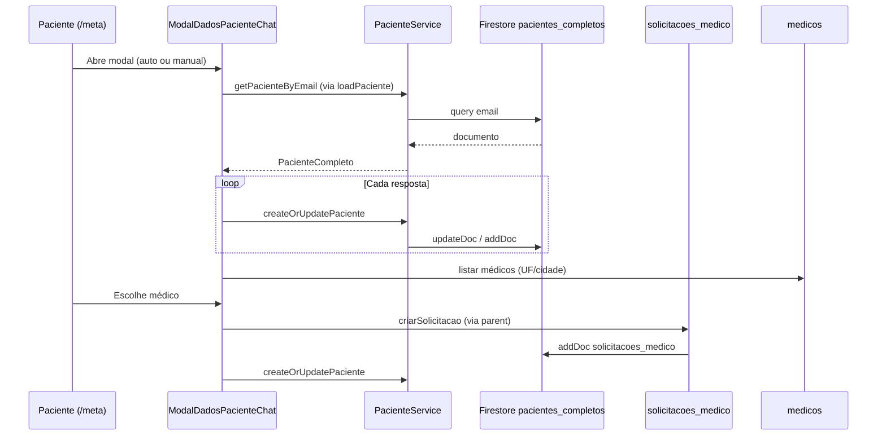

# Chat inicial do paciente em `/meta` — fluxo, dados e Firebase

Documento de referência sobre o questionário em formato de chat exibido na página **`/meta`**, as informações coletadas do paciente e onde cada dado é persistido no Firestore.

**Última revisão com base no código:** maio/2026.

---

## 1. Visão geral

| Item | Detalhe |
|------|---------|
| **Rota** | `app/meta/page.tsx` → URL `/meta` |
| **Componente do chat** | `components/ModalDadosPacienteChat.tsx` |
| **Modal na página** | Abre em tela cheia quando `showModalDadosPaciente === true` e **não** há `?pacienteId=` na URL (modo nutricionista não usa este chat) |
| **Persistência do chat** | As **bolhas de conversa** ficam só em memória (`useState` em `messages`). **Não** há coleção de “mensagens do chat inicial”. |
| **Persistência dos dados** | A cada resposta enviada (na maioria dos passos), o app chama `PacienteService.createOrUpdatePaciente()` → documento em **`pacientes_completos`** |
| **Leitura do paciente** | `loadPaciente()` → `PacienteService.getPacienteByEmail(user.email)` ou `getPacienteById(pacienteId)` |
| **Preview admin** | `app/metaadmingeral/chatinicial/page.tsx` — mesmo componente, `onSave` noop (não grava produção) |

### Arquivos relacionados (documentação interna)

- `app/meta/PERGUNTAS_ENTREVISTA_PACIENTE_V2.md` — textos e chaves (alguns passos evoluíram; ver seção 3)
- `app/meta/MAPEAMENTO_V2_CHAT_VS_METAADMIN.md` — ordem V2 vs metaadmin
- `types/obesidade.ts` — tipo `PacienteCompleto` e subestruturas

---

## 2. Quando o chat abre em `/meta`

Lógica em `app/meta/page.tsx` (`useEffect` após `loadPaciente`):

1. Usuário autenticado (`user.uid`).
2. **Sem** `pacienteId` na query string.
3. Paciente já carregado (`loadingPaciente === false`).
4. O usuário **não** fechou o modal manualmente (`modalDadosPacienteFoiFechadoRef`).
5. Ainda **não** tentou abrir nesta sessão (`modalDadosAberturaTentadaRef` — marcado só **dentro** do `setTimeout` de 200 ms).
6. **Não** abre se `getFirstIncompleteStep(paciente) === 17` (perfil completo + médico já vinculado).
7. **Não** abre se já existe `medicoResponsavelId` preenchido (completar dados fora do chat).
8. Caso contrário: `openModalDadosPaciente()` após 200 ms.

Ao fechar o modal (overlay ou `onClose`), a página chama `loadPaciente()` de novo para sincronizar com o Firestore.

---

## 3. Passos do chat (ordem real no código)

Função de retomada: `getFirstIncompleteStep()` em `ModalDadosPacienteChat.tsx`.

| Step | Bloco | Pergunta / ação (resumo) | Onde persiste no Firestore |
|------|--------|---------------------------|----------------------------|
| **0** | Abertura | “Vamos montar juntos um plano…” + botão **Começar agora** | **Não** grava no paciente. Apenas `sessionStorage` → chave `meta-chat-intro-v2` (`META_CHAT_INTRO_SESSION_KEY`) = `'1'` |
| **1** | Telefone | Telefone BR (mín. 10 dígitos) | `dadosIdentificacao.telefone` |
| **2** | Data de nascimento | Dia + mês + ano | `dadosIdentificacao.dataNascimento` (Date) |
| **3** | Gênero | Masculino / Feminino / Prefiro não responder | `dadosIdentificacao.sexoBiologico` → `'M'` \| `'F'` \| `'Outro'` |
| **4** | CPF | Máscara 11 dígitos | `dadosIdentificacao.cpf` (só dígitos no objeto) |
| **5** | Peso | kg (aproximado ok) | `dadosClinicos.medidasIniciais.peso` |
| **6** | Altura | cm ou metros (normalizado para **cm**) | `dadosClinicos.medidasIniciais.altura` |
| **7** | Circunferência abdominal | **Não sei** → `circunferenciaNaoInformada: true`, `circunferenciaAbdominal: 0`; ou valor em cm | `dadosClinicos.medidasIniciais.circunferenciaAbdominal`, `dadosClinicos.medidasIniciais.circunferenciaNaoInformada` |
| **8** | Motivação | Múltipla escolha + “Outro” opcional | `dadosClinicos.motivacao.*` (booleanos), `dadosClinicos.motivacaoOutro` |
| **9** | Diagnóstico principal | Múltipla (motivo do acompanhamento) | `dadosClinicos.diagnosticoPrincipalTipos[]` e/ou `dadosClinicos.diagnosticoPrincipal.tipo` + `outro` |
| **10** | Comorbidades | Múltipla + “Outra” | `dadosClinicos.comorbidades.*`, `comorbidades.outraDescricao`; flag `dadosClinicos.chatComorbidadesEnviado: true` ao enviar |
| **11** | Riscos | Sequência Sim/Não/(Desconheço) | `dadosClinicos.riscos.<chave>` → `'sim'` \| `'nao'` \| `'desconheco'` |
| **12** | Tireoide | Única + “Outro” texto | `dadosClinicos.historiaTireoidiana`, `historiaTireoidianaOutro` |
| **13** | Sintomas GI | Múltipla | `dadosClinicos.sintomasGI.*` |
| **14** | Metas do tratamento | Barras % peso e, se houver cintura inicial, cm de redução | `planoTerapeutico.metas.*` (ver seção 5) |
| **15** | Busca médico | UF + cidade | **Não** persiste UF/cidade no paciente; só filtra lista |
| **16** | Lista de médicos | Escolha + solicitar tratamento | Ver seção 6 (`solicitacoes_medico`); opcionalmente `medicoResponsavelId` no objeto local ao solicitar |
| **17** | Perfil completo | Médico **já** vinculado — sem busca | Nenhum campo novo; passo terminal de UI |
| **18** | Pós-solicitação | “Solicitação enviada” | Estado só de UI (`step === 18`) |

> **Nota:** O passo de **objetivos do tratamento** (`dadosClinicos.objetivosTratamento`) foi substituído no chat pelo passo **14 (metas)**. Pacientes antigos ainda podem ter `objetivosTratamento` preenchido; `getFirstIncompleteStep` aceita isso como equivalente ao passo 14.

### 3.1 Textos do bot por passo (`CHAT_BOT_TEXTS`)

Índice do array = `step - 1` (steps 1–14). Steps 15+ usam `TEXTO_PESQUISA_MEDICO` ou textos de fechamento.

### 3.2 Passo 11 — perguntas de risco (`RISK_QUESTIONS`)

| Ordem | Chave Firestore | Pergunta | Opções |
|-------|-----------------|----------|--------|
| 1 | `pancreatitePrevia` | Já teve pancreatite? | sim, nao |
| 2 | `gastroparesia` | Esvaziamento lento do estômago (gastroparesia)? | sim, nao |
| 3 | `historicoCMT_MEN2` | Histórico familiar CMT ou MEN2? | sim, nao, desconheco |
| 4* | `gestacao` | Grávida ou pode estar? | sim, nao, desconheco |
| 5* | `lactacao` | Amamentando? | sim, nao |

\* `gestacao` e `lactacao` só se `sexoBiologico` for `'F'` ou `'Outro'`.

### 3.3 Passo 8 — motivação (`motivacao`)

| Chave | Rótulo no chat |
|-------|----------------|
| `estetica` | Estética |
| `cansaco_falta_energia` | Cansaço / falta de energia |
| `saude_exames_alterados` | Saúde / exames alterados |
| `autoestima` | Autoestima |
| `dificuldade_emagrecer` | Dificuldade para emagrecer |
| `outro` | Outro (+ `motivacaoOutro`) |

### 3.4 Passo 9 — diagnóstico principal

Valores internos (`diagnosticoPrincipalTipos` / `diagnosticoPrincipal.tipo`):

`dm1`, `dm2`, `pre_diabetes`, `sobrepeso_comorbidade`, `sop_ri`, `ehna_sem_dm2`, `obesidade`, `resistencia_insulinica`, `outro`.

### 3.5 Passo 10 — comorbidades

Chaves em `dadosClinicos.comorbidades`: `hipertensaoArterial`, `dislipidemia`, `apneiaObstrutivaSono`, `esteatoseEHNA`, `doencaCardiovascular`, `doencaRenalCronica`, `sop`, `hipotireoidismo`, `asmaDPOC`, `transtornoAnsiedadeDepressao`, `nenhuma`, `outra` (+ `outraDescricao`).

### 3.6 Passo 12 — tireoide (`historiaTireoidiana`)

`eutireoidismo`, `hipotireoidismo_tratado`, `nodulo_bocio`, `tireoidite_previa`, `cmt_confirmado`, `outro`.

### 3.7 Passo 13 — sintomas GI (`sintomasGI`)

`plenitudePosPrandial`, `nauseaLeve`, `constipacao`, `refluxoPirose`, `nenhum`.

---

## 4. Coleção principal: `pacientes_completos`

### 4.1 Identificação do documento

| Cenário | Como o documento é encontrado / criado |
|---------|----------------------------------------|
| Login em `/meta` | Query `where('email', '==', user.email)` → `getPacienteByEmail` |
| Sem `id` ao salvar | Query `where('userId', '==', paciente.userId)`; se vazio, `addDoc` cria novo |
| Com `id` | `updateDoc(pacientes_completos/{id})` |

**ID do documento:** auto-gerado pelo Firestore (`docRef.id`), exposto como `paciente.id`.

### 4.2 Campos de nível raiz usados no chat inicial

```text
pacientes_completos/{pacienteId}
├── id                    (implícito no SDK)
├── userId                ← Firebase Auth UID
├── email                 ← usado na busca por email
├── nome
├── medicoResponsavelId   ← null até vínculo; pode ser setado ao solicitar médico no chat
├── dadosIdentificacao    ← passos 1–4
├── dadosClinicos         ← passos 5–13 (+ flags auxiliares)
├── planoTerapeutico      ← passo 14 (metas)
├── estiloVida            ← {} no cadastro mínimo
├── examesLaboratoriais   ← []
├── evolucaoSeguimento    ← []
├── alertas               ← []
├── comunicacao           ← { mensagens, anexos, logsAuditoria } (estrutura legada no cadastro)
├── indicadores           ← defaults no primeiro create
├── dataCadastro
├── status                ← 'ativo'
├── statusTratamento      ← 'pendente' (cadastro novo)
├── recomendacoesLidas    ← fora do chat; modal de recomendações em /meta
├── dataLeituraRecomendacoes
└── recomendacoesTermoVersao
```

### 4.3 `dadosIdentificacao` (chat passos 1–4)

```text
dadosIdentificacao
├── nomeCompleto
├── email
├── telefone              ← passo 1
├── cpf                   ← passo 4
├── dataNascimento        ← passo 2 (Timestamp/Date no Firestore)
├── sexoBiologico         ← passo 3: 'M' | 'F' | 'Outro'
├── endereco              ← objeto (pode vir vazio)
└── dataCadastro
```

### 4.4 `dadosClinicos` (chat passos 5–13)

```text
dadosClinicos
├── medidasIniciais
│   ├── peso
│   ├── altura              (cm)
│   ├── imc                   (calculado em outros fluxos; chat foca peso/altura)
│   ├── circunferenciaAbdominal
│   └── circunferenciaNaoInformada   (boolean, passo 7 “Não sei”)
├── motivacao                 (objeto de flags, passo 8)
├── motivacaoOutro
├── diagnosticoPrincipalTipos (array, passo 9)
├── diagnosticoPrincipal      { tipo, outro? }
├── comorbidades              { ...flags booleanas, outraDescricao? }
├── chatComorbidadesEnviado   (boolean, passo 10)
├── riscos                    { pancreatitePrevia, gastroparesia, ... }
├── historiaTireoidiana
├── historiaTireoidianaOutro
├── sintomasGI                { ...flags }
└── objetivosTratamento       (legado; não é mais passo obrigatório do chat)
```

**Normalização na leitura:** `PacienteService.normalizePacienteFirestoreData()` funde cópias legadas na raiz (`medidasIniciais`, `motivacao`, `dados_clinicos`, etc.) em `dadosClinicos`.

### 4.5 Subcoleção ligada ao paciente (fora do chat, mesma jornada `/meta`)

| Subcoleção | Caminho | Uso |
|------------|---------|-----|
| `consentimentos_recomendacoes` | `pacientes_completos/{id}/consentimentos_recomendacoes/{consentId}` | Aceite do termo de recomendações (API `POST /api/meta/recomendacoes-consent`) |
| `nutricao/plano`, `nutricao/dados` | sob o paciente | Nutri (não preenchidos pelo chat inicial) |
| `chatNutri/{dateKey}/messages` | sob o paciente | Chat Nutri IA (fluxo separado) |

Campos no documento raiz após recomendações: `recomendacoesLidas`, `dataLeituraRecomendacoes`, `recomendacoesTermoVersao`.

---

## 5. Passo 14 — `planoTerapeutico.metas`

Persistido em:

```text
planoTerapeutico.metas
├── metasTratamentoModuloAtivo    (boolean)
├── metaPerdaPesoAtiva
├── metaReducaoCinturaAtiva       (só relevante se há circunferência inicial)
├── weightLossTargetType          ('PERCENTUAL' | 'PESO_ABSOLUTO')
├── weightLossTargetValue         (% ou kg conforme o tipo)
├── waistReductionTargetCm        (redução de cintura em cm)
└── secondaryGoals                (objeto opcional)
```

Validação de passo completo: `metasTratamentoPasso14Ok()` — exige módulo ativo e meta de peso e/ou cintura conforme switches.

O mesmo bloco pode ser editado depois no modal **Metas do tratamento** em `/meta` (`showModalMetasTratamento` + `MetaadminPlanoTerapeuticoEditSections`), também salvando via `createOrUpdatePaciente`.

---

## 6. Passos 15–16 — médicos e solicitações

### 6.1 Lista de médicos (somente leitura)

| Coleção | Uso no chat |
|---------|-------------|
| **`medicos`** | `MedicoService` carrega profissionais com `isVerificado === true` e `cidades` preenchidas; filtro por UF/cidade no cliente |

Dados exibidos: nome, foto, classificação (`ClassificacaoProfissionalService` — agregados por `medicoId`).

### 6.2 Solicitação de tratamento

Ao confirmar médico no chat (`onCreateSolicitacao` em `/meta`):

| Coleção | Caminho | Campos principais |
|---------|---------|-------------------|
| **`solicitacoes_medico`** | `solicitacoes_medico/{solicitacaoId}` | `pacienteId`, `pacienteEmail`, `pacienteNome`, `pacienteTelefone`, `medicoId`, `medicoNome`, `status: 'pendente'`, `criadoEm` |

Serviço: `SolicitacaoMedicoService.criarSolicitacao()`.

Regras:

- Não cria nova solicitação se já existe `pendente` ou `aceita` para o mesmo email (`onCheckSolicitacaoAberta`).
- Após criar: `createOrUpdatePaciente(pacienteAtualizado)` e `loadMinhasSolicitacoes()`.
- O vínculo definitivo **`medicoResponsavelId`** no paciente costuma ser consolidado quando o médico **aceita** a solicitação (fluxo metaadmin); no chat, o objeto pode receber `medicoResponsavelId` ao montar a solicitação.

### 6.3 Indicações (opcional)

Se houver telefone e fluxo de indicação por link, `criarSolicitacao` pode chamar `IndicacaoService` (coleção de indicações — ver `services/indicacaoService.ts`).

---

## 7. Quando os dados são gravados

| Momento | Comportamento |
|---------|----------------|
| Cada “Enviar” / escolha que chama `pushReplyAndNext()` | `onSave(false, pacienteAtualizado)` → `PacienteService.createOrUpdatePaciente()` |
| Passo 1 (telefone) | `onSave` direto antes de avançar para step 2 |
| Passo 10 (comorbidades) | `onSave` ao enviar lote |
| Passo 14 → 15 | Mensagem de fechamento; depois step 15 sem novo campo de anamnese |
| Solicitar médico | `onCreateSolicitacao` + `createOrUpdatePaciente` |
| Fechar modal | `loadPaciente()` (releitura Firestore) |

`removeUndefined()` em `pacienteService.ts` remove campos `undefined` antes do `updateDoc`/`addDoc`.

**Primeiro cadastro:** se não existir documento, `addDoc` em `pacientes_completos` com estrutura mínima (peso/altura podem ser criados também no fluxo paralelo de “solicitar médico” fora do chat).

---

## 8. O que não é o “chat inicial”

| Recurso | Coleção / local | Observação |
|---------|-----------------|------------|
| Mensagens médico ↔ paciente na aba do `/meta` | **`pacientes_mensagens`** | `PacienteMensagemService` — `where('pacienteEmail', '==', email)`; **não** é o questionário |
| Chat Nutri | `pacientes_completos/{id}/chatNutri/...` | IA / refeições |
| Mensagens admin/residente | `mensagens`, `mensagens_residentes`, etc. | Outro produto |
| Bolhas do `ModalDadosPacienteChat` | Memória React | Perdidas ao fechar; retomada via `getFirstIncompleteStep` + Firestore |

---

## 9. Fluxo de dados (diagrama)



---

## 10. Retomada de sessão

| Mecanismo | Função |
|-----------|--------|
| `sessionStorage['meta-chat-intro-v2']` | Se `'1'`, pula step 0 (não mostra “Começar” de novo na mesma aba) |
| `getFirstIncompleteStep(paciente)` | Calcula o primeiro passo sem dado obrigatório |
| `resumeAfterLoadTick` | Após `loadPaciente`, avança o step se o Firestore já tem mais respostas |
| `metaPacienteLoadTick` em `/meta` | Incrementado no `finally` de `loadPaciente` |

---

## 11. Modo nutricionista (`/meta?pacienteId=...`)

- Carrega paciente por ID (`getPacienteById` ou lista nutri).
- **Não** abre o modal de chat inicial automaticamente.
- Chat inicial documentado aqui é o fluxo do **próprio paciente** logado.

---

## 12. Referência rápida — mapa passo → campo Firestore

| Step | Campo(s) Firestore |
|------|---------------------|
| 0 | `sessionStorage` apenas |
| 1 | `dadosIdentificacao.telefone` |
| 2 | `dadosIdentificacao.dataNascimento` |
| 3 | `dadosIdentificacao.sexoBiologico` |
| 4 | `dadosIdentificacao.cpf` |
| 5 | `dadosClinicos.medidasIniciais.peso` |
| 6 | `dadosClinicos.medidasIniciais.altura` |
| 7 | `dadosClinicos.medidasIniciais.circunferenciaAbdominal` ou `circunferenciaNaoInformada` |
| 8 | `dadosClinicos.motivacao`, `motivacaoOutro` |
| 9 | `diagnosticoPrincipalTipos`, `diagnosticoPrincipal` |
| 10 | `comorbidades`, `chatComorbidadesEnviado` |
| 11 | `riscos.*` |
| 12 | `historiaTireoidiana`, `historiaTireoidianaOutro` |
| 13 | `sintomasGI.*` |
| 14 | `planoTerapeutico.metas.*` |
| 15–16 | `solicitacoes_medico` (+ leitura `medicos`) |
| 17 | — (UI; `medicoResponsavelId` já existe) |
| 18 | — (UI pós-solicitação) |

---

*Gerado para manutenção do produto Meta (/meta). Para alterar textos ou ordem, editar `ModalDadosPacienteChat.tsx` e alinhar este arquivo.*
