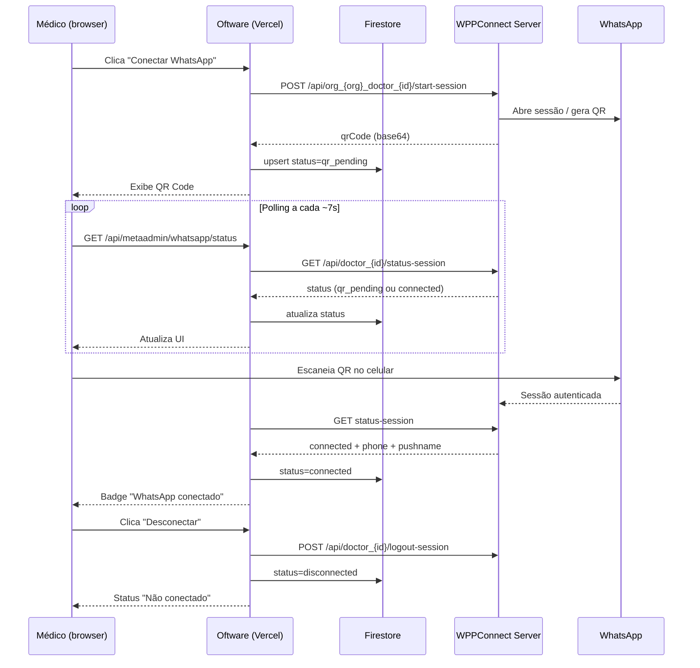

# WPPConnect Server — Setup para ambiente real (Etapas 3–4)

**Tipo:** documentação técnica / checklist de deploy  
**Escopo atual:** conectar WhatsApp do médico, exibir QR Code real, verificar status e desconectar.  
**Fora de escopo:** CRM, envio de mensagens, sincronização de conversas ou contatos.

**Relacionado no código:**
- Provider: `services/whatsappProviderClient.ts`
- Persistência: `services/whatsappConnectionService.ts` → coleção Firestore `whatsappConnections`
- Contexto médico/org: `lib/server/whatsappMedicoContext.server.ts`
- Infra Cloud Run: `infra/whatsapp/wppconnect/`
- API Oftware: `/api/metaadmin/whatsapp/start-session`, `/status`, `/disconnect`
- UI: aba **WhatsApp** em `/metaadmin` → Meu Perfil

---

## Arquitetura white label da Oftware

A Oftware é uma **plataforma white label**: cada organização tem domínio e `/metaadmin` próprios (ex.: `www.ometodoemagrecer.com.br/metaadmin`, `www.clinicaexemplo.com.br/metaadmin`).

O servidor WhatsApp é **único e centralizado** na Oftware — **não** há um WPPConnect por organização.

| Conceito | Comportamento |
|----------|---------------|
| **WPPConnect** | Central em `https://whatsapp.oftware.com.br` (Cloud Run) |
| **WPP_SERVER_URL** | O **mesmo** em todas as instâncias Vercel das organizações |
| **WPP_SERVER_TOKEN** | Token Bearer **central** da Oftware (não por organização) |
| **Isolamento** | Por `sessionId` estável por médico + organização |
| **sessionId** | `org_{organizationId}_doctor_{doctorId}` |
| **Fallback** | Sem `organizationId`: `doctor_{doctorId}` |

### O que isso significa na prática

- **Servidor central ≠ WhatsApp compartilhado.** Cada médico escaneia o **próprio** WhatsApp no celular.
- A Oftware apenas **hospeda o motor de sessão** (Puppeteer/Chromium no Cloud Run).
- O número conectado **pertence ao médico**, não à organização nem à plataforma.
- A organização **não precisa hospedar** nada relacionado a WhatsApp.
- Múltiplas organizações e múltiplos médicos coexistem no mesmo servidor com sessões isoladas por `sessionId`.

```
www.org-a.com.br/metaadmin  ──┐
www.org-b.com.br/metaadmin  ──┼──> Vercel (org A, B, C…) ──> API Oftware
www.org-c.com.br/metaadmin  ──┘              │
                                             ▼
                              https://whatsapp.oftware.com.br
                              (WPPConnect central — Cloud Run)
                                             │
                         sessionId: org_a_doctor_123  |  org_b_doctor_456
```

### Variáveis Vercel (todas as organizações)

```env
WHATSAPP_MOCK_MODE=false
WPP_SERVER_URL=https://whatsapp.oftware.com.br
WPP_SERVER_TOKEN=token_central_da_oftware
WPP_REQUEST_TIMEOUT_MS=30000
```

Infra versionada: `infra/whatsapp/wppconnect/` (Cloud Run, futuro) · **`infra/whatsapp/vm/` (VM — Etapa 4.2, recomendado)**.

---

## 1. Por que o WPPConnect Server precisa rodar fora da Vercel

O Oftware (Next.js na Vercel) **não hospeda** o WPPConnect Server. São sistemas separados:

| Requisito do WPPConnect | Limitação na Vercel |
|-------------------------|---------------------|
| Chromium/Puppeteer rodando continuamente | Funções serverless são efêmeras; não mantêm browser aberto |
| Sessão WhatsApp persistente em memória/disco | Cold starts encerram o processo; sessão se perde |
| Processo long-running (minutos/horas/dias) | Timeout máximo de execução por request (segundos) |
| Alto consumo de RAM (browser headless) | Limites de memória por função inadequados para múltiplas sessões |
| Estado local (userDataDir, tokens de sessão) | Filesystem efêmero entre invocações |

**Arquitetura correta:**

```
[Médico no browser]
       ↓
[Oftware / Vercel]  — API routes, Firestore, UI
       ↓ HTTP (Bearer token)
[WPPConnect Server] — Railway / VPS / Cloud Run
       ↓
[WhatsApp Web / API não oficial]
```

O Oftware apenas **orquestra** a conexão: chama o servidor externo, salva status no Firestore e exibe o QR na UI. O browser do WhatsApp vive no WPPConnect Server.

---

## 2. Opções de hospedagem

### Railway — teste rápido (recomendado para validar Etapa 3)

**Quando usar:** primeiro deploy, POC com um médico, iteração rápida.

| Prós | Contras |
|------|---------|
| Deploy simples (Docker ou repo) | Custo pode subir com uso contínuo |
| HTTPS público automático | Menos controle fino de rede/firewall |
| Logs e variáveis de ambiente na UI | Reinícios podem derrubar sessões ativas |

**Sugestão:** 1 instância, 1–2 GB RAM, volume persistente para `userDataDir` / tokens se disponível.

---

### VPS — controle total (recomendado para homologação estável)

**Quando usar:** equipe confortável com Linux, necessidade de IP fixo, firewall e backups.

| Prós | Contras |
|------|---------|
| Controle de SO, Docker, Nginx, firewall | Você gerencia updates, segurança e monitoramento |
| Disco persistente para sessões | HTTPS exige Certbot ou proxy reverso |
| Custo previsível (Hetzner, DigitalOcean, etc.) | Escalar manualmente |

**Sugestão:** Ubuntu 22.04+, Docker Compose, Nginx com TLS na frente, mínimo 2 GB RAM.

---

### Google Cloud Run — produção (recomendado — Etapa 4)

**Quando usar:** ambiente central white label da Oftware em produção.

| Parâmetro | Valor |
|-----------|-------|
| Serviço | `oftware-whatsapp-wppconnect` |
| Região | `us-central1` |
| URL pública | `https://whatsapp.oftware.com.br` (domain mapping) |
| Memória | `2Gi` |
| min instances | `1` (obrigatório para sessões estáveis) |

Deploy: `infra/whatsapp/wppconnect/deploy.sh` ou `cloudbuild.yaml`. Ver `infra/whatsapp/wppconnect/README.md`.

---

## 3. Variáveis no Oftware (Vercel)

Configurar em **Project Settings → Environment Variables** (Production e Preview conforme necessidade):

| Variável | Valor | Obrigatória |
|----------|-------|-------------|
| `WHATSAPP_MOCK_MODE` | `false` | Sim (ambiente real) |
| `WPP_SERVER_URL` | `https://whatsapp.oftware.com.br` (central Oftware) | Sim |
| `WPP_SERVER_TOKEN` | Token Bearer gerado no WPPConnect Server | Sim |
| `WPP_REQUEST_TIMEOUT_MS` | `30000` | Recomendado |

**Exemplo:**

```env
WHATSAPP_MOCK_MODE=false
WPP_SERVER_URL=https://wpp.seudominio.com
WPP_SERVER_TOKEN=seu_token_bearer_aqui
WPP_REQUEST_TIMEOUT_MS=30000
```

**Comportamento no código:**
- Mock ativo apenas se `WHATSAPP_MOCK_MODE=true` **ou** `WPP_SERVER_URL` vazio.
- O Oftware envia `Authorization: Bearer ${WPP_SERVER_TOKEN}` em todas as chamadas ao WPPConnect.
- `sessionId` por médico: `org_{organizationId}_doctor_{doctorId}` (fallback: `doctor_{doctorId}`).

Após alterar variáveis na Vercel, **redeploy** o projeto Oftware.

---

## 4. Checklist de deploy do WPPConnect Server

### 4.1 Pré-requisitos

| # | Item | Status |
|---|------|--------|
| 4.1.1 | Repositório ou imagem Docker do [wppconnect-server](https://github.com/wppconnect-team/wppconnect-server) definido | ☐ |
| 4.1.2 | Domínio ou URL pública HTTPS para o servidor (ex.: `https://wpp.seudominio.com`) | ☐ |
| 4.1.3 | `secretKey` do WPPConnect definido (não commitar em repositório público) | ☐ |
| 4.1.4 | Token de acesso gerado e anotado em local seguro (será o `WPP_SERVER_TOKEN` no Oftware) | ☐ |
| 4.1.5 | Mínimo 2 GB RAM alocado ao container/VM | ☐ |

### 4.2 Deploy

| # | Item | Status |
|---|------|--------|
| 4.2.1 | Servidor/container em execução e escutando na porta configurada (padrão WPPConnect: `21465`) | ☐ |
| 4.2.2 | HTTPS terminado (Railway automático, ou Nginx/Caddy na VPS, ou Cloud Run managed) | ☐ |
| 4.2.3 | Variáveis do WPPConnect configuradas (`secretKey`, `host`, `port`, etc.) | ☐ |
| 4.2.4 | Volume/disco persistente para dados de sessão (se a plataforma suportar) | ☐ |
| 4.2.5 | Firewall: porta exposta apenas via HTTPS (443); não expor 21465 publicamente sem proxy | ☐ |

### 4.3 Segurança

| # | Item | Status |
|---|------|--------|
| 4.3.1 | `WPP_SERVER_TOKEN` forte e exclusivo para o Oftware | ☐ |
| 4.3.2 | Servidor WPPConnect **não** acessível sem token Bearer | ☐ |
| 4.3.3 | IP ou rede restrita se possível (allowlist Vercel é difícil — priorize token forte + HTTPS) | ☐ |
| 4.3.4 | Logs do WPPConnect sem expor QR completo ou tokens em produção | ☐ |

### 4.4 Validação do servidor (antes de conectar o Oftware)

Testar manualmente com `curl` (substituir `SESSION`, `URL` e `TOKEN`):

```bash
# Iniciar sessão (gera QR)
curl -X POST "https://URL/api/SESSION/start-session" \
  -H "Accept: application/json" \
  -H "Content-Type: application/json" \
  -H "Authorization: Bearer TOKEN"

# Consultar status
curl -X GET "https://URL/api/SESSION/status-session" \
  -H "Accept: application/json" \
  -H "Authorization: Bearer TOKEN"

# Encerrar sessão
curl -X POST "https://URL/api/SESSION/logout-session" \
  -H "Accept: application/json" \
  -H "Authorization: Bearer TOKEN"
```

| # | Item | Status |
|---|------|--------|
| 4.4.1 | `start-session` retorna QR Code (base64 ou data URL) | ☐ |
| 4.4.2 | `status-session` responde com status reconhecível | ☐ |
| 4.4.3 | `logout-session` encerra sem erro crítico | ☐ |
| 4.4.4 | Swagger/docs acessível em `/api-docs` (opcional, útil para debug) | ☐ |

### 4.5 Conectar ao Oftware

| # | Item | Status |
|---|------|--------|
| 4.5.1 | Variáveis Vercel configuradas (seção 3) | ☐ |
| 4.5.2 | Redeploy do Oftware após setar env vars | ☐ |
| 4.5.3 | Logs Vercel mostram `[whatsapp.provider] startSession` com `mode: wppconnect` (não `mock`) | ☐ |

---

## 5. Checklist de teste na aba WhatsApp

Executar com **um médico de teste** em ambiente de staging ou produção controlada.

| # | Passo | Resultado esperado | Status |
|---|-------|-------------------|--------|
| 5.1 | Login como médico em `/metaadmin` | Acesso ao painel | ☐ |
| 5.2 | Ir em **Meu Perfil** → aba **WhatsApp** | Status **Não conectado** | ☐ |
| 5.3 | Clicar **Conectar WhatsApp** | Loading breve; sem erro 500 | ☐ |
| 5.4 | Verificar QR Code na tela | QR **real** (não placeholder mock verde) | ☐ |
| 5.5 | Verificar badge | **Aguardando leitura do QR Code** | ☐ |
| 5.6 | Escanear QR com WhatsApp do médico (Aparelhos conectados) | WhatsApp aceita pareamento | ☐ |
| 5.7 | Aguardar polling (~7 s) ou clicar **Atualizar status** | Badge **WhatsApp conectado** | ☐ |
| 5.8 | Conferir número e nome do perfil (se retornados pelo WPPConnect) | Dados exibidos corretamente | ☐ |
| 5.9 | Verificar Firestore `whatsappConnections/{doctorId}` | `status: connected`, `phone`, `connectedAt` | ☐ |
| 5.10 | Clicar **Desconectar** | Status **Não conectado** | ☐ |
| 5.11 | Recarregar a página | Status persiste **desconectado** | ☐ |
| 5.12 | Clicar **Reconectar** | Novo QR gerado; fluxo repete | ☐ |

**Se falhar:** verificar logs Vercel (`[whatsapp.provider]`, `[metaadmin/whatsapp/*]`) e logs do container WPPConnect.

---

## 6. Fluxo esperado (ponta a ponta)



**Resumo em texto:**
1. Médico clica **Conectar** → Oftware chama WPPConnect (`start-session`).
2. QR real aparece na aba WhatsApp.
3. Médico escaneia no app WhatsApp.
4. Polling detecta `connected` → Firestore atualizado → UI mostra conectado.
5. **Desconectar** chama `logout-session` no WPPConnect e limpa status no Firestore.

---

## 7. Alertas importantes (escopo do MVP)

> **Não fazer nesta etapa**

| Proibido agora | Motivo |
|----------------|--------|
| Sincronizar conversas | Fora do escopo; risco LGPD e complexidade |
| Puxar contatos | Não necessário para validar sessão |
| Enviar mensagens (lembretes, templates) | Etapa futura, após sessão estável |
| Criar CRM / inbox WhatsApp | Produto separado; não misturar com conexão |
| Webhooks de mensagens recebidas | Ativar só quando houver requisito explícito |

> **Fazer agora**

- Validar que **um médico** consegue conectar e desconectar.
- Confirmar persistência em `whatsappConnections`.
- Confirmar que o Oftware **só** usa os endpoints de sessão (`start-session`, `status-session`, `logout-session`).
- Usar conexão apenas para **provar que a sessão está ativa** antes de implementar lembretes automáticos.

**LGPD / segurança:** não armazenar conteúdo de mensagens; não logar QR completo, token ou telefone integral em produção.

---

## 8. Próxima etapa (após ambiente real validado)

### 8.1 Teste controlado com um único médico

| # | Item | Status |
|---|------|--------|
| 8.1.1 | Escolher 1 médico piloto (não rollout geral) | ☐ |
| 8.1.2 | Documentar `doctorId`, `organizationId` e `sessionId` (`org_{org}_doctor_{id}`) do piloto | ☐ |
| 8.1.3 | Executar checklist da seção 5 em horário combinado com o médico | ☐ |
| 8.1.4 | Registrar evidência: screenshot conectado + documento Firestore | ☐ |

### 8.2 Persistência de status

| # | Item | Status |
|---|------|--------|
| 8.2.1 | Confirmar documento em `whatsappConnections/{doctorId}` após conectar | ☐ |
| 8.2.2 | Confirmar campos: `status`, `sessionId`, `phone`, `profileName`, `connectedAt`, `lastCheckAt` | ☐ |
| 8.2.3 | Confirmar que outro médico **não** vê a conexão do piloto (isolamento por `doctorId`) | ☐ |

### 8.3 Reconexão após restart do servidor WPPConnect

| # | Item | Status |
|---|------|--------|
| 8.3.1 | Com médico conectado, reiniciar container/VM do WPPConnect | ☐ |
| 8.3.2 | Abrir aba WhatsApp no Oftware | ☐ |
| 8.3.3 | Verificar se status reflete realidade (pode mostrar erro ou desconectado) | ☐ |
| 8.3.4 | Clicar **Reconectar** e validar novo QR + nova conexão | ☐ |
| 8.3.5 | Documentar comportamento observado para definir política de restart (manutenção, alertas) | ☐ |

### 8.4 Depois da validação (roadmap, não implementar agora)

- Envio de lembretes diários de aplicação (Etapa futura).
- Fila/retry para mensagens quando sessão cair.
- Monitoramento de saúde do WPPConnect (uptime, sessões ativas).
- Política de backup do `userDataDir` / tokens de sessão.

### 8.5 Isolamento white label (Etapa 4)

| # | Item | Status |
|---|------|--------|
| 8.5.1 | Médico da org A conecta — `sessionId` contém `org_{orgA}_doctor_{id}` | ☐ |
| 8.5.2 | Médico da org B conecta — `sessionId` diferente, sem interferência | ☐ |
| 8.5.3 | Ambos usam o mesmo `WPP_SERVER_URL` central | ☐ |
| 8.5.4 | Firestore: cada doc `whatsappConnections/{doctorId}` com `organizationId` correto | ☐ |

### 8.6 Checklist infra Cloud Run (Etapa 4)

| # | Item | Status |
|---|------|--------|
| 8.6.1 | Build Docker local (`infra/whatsapp/wppconnect`) | ☐ |
| 8.6.2 | Deploy Cloud Run `oftware-whatsapp-wppconnect` | ☐ |
| 8.6.3 | URL pública do serviço anotada | ☐ |
| 8.6.4 | Domínio `whatsapp.oftware.com.br` mapeado (DNS + Cloud Run) | ☐ |
| 8.6.5 | `SECRET_KEY` no Secret Manager; token Bearer gerado para Vercel | ☐ |
| 8.6.6 | Vercel de todas as orgs com `WPP_SERVER_URL` central | ☐ |
| 8.6.7 | Teste: 1 médico em 1 organização | ☐ |
| 8.6.8 | Teste: outro médico em outra organização (isolamento por sessionId) | ☐ |

---

## Referências rápidas

| Recurso | URL |
|---------|-----|
| WPPConnect Server (GitHub) | https://github.com/wppconnect-team/wppconnect-server |
| Documentação WPPConnect | https://wppconnect-team.github.io/docs/projects/wppserver/introduction |
| Postman WPPConnect | https://documenter.getpostman.com/view/9139457/TzshF4jQ |
| Endpoints usados pelo Oftware | `POST/GET /api/:session/start-session`, `GET status-session`, `POST logout-session` |

| Infra Oftware (Cloud Run) | `infra/whatsapp/wppconnect/README.md` |

---

**Última atualização:** Etapa 4 — WPPConnect central white label + infra Cloud Run. Sem envio de mensagens.
